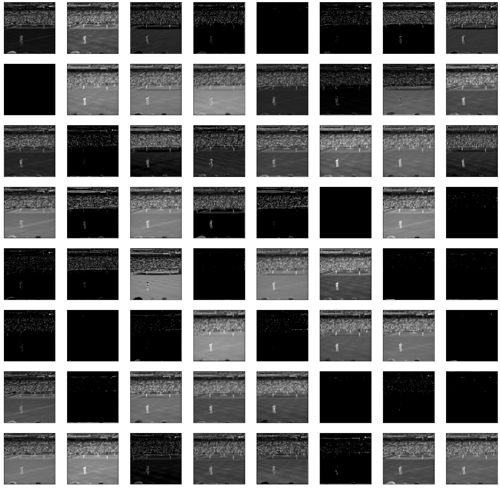
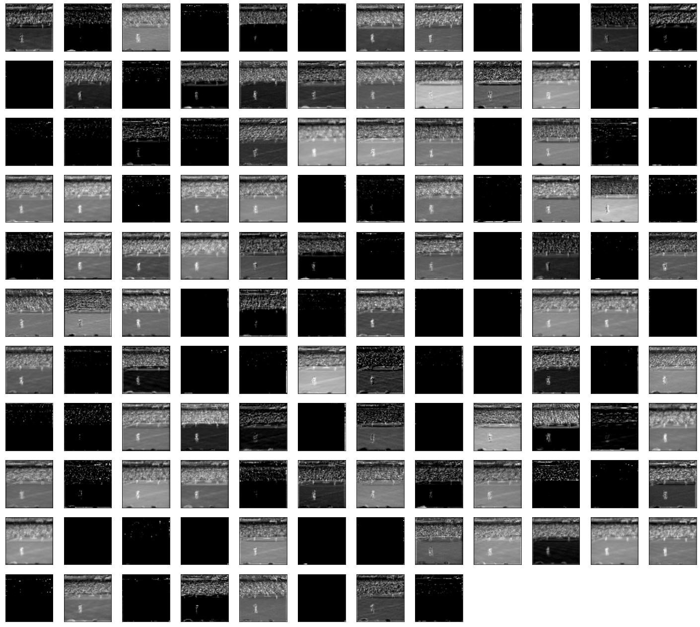
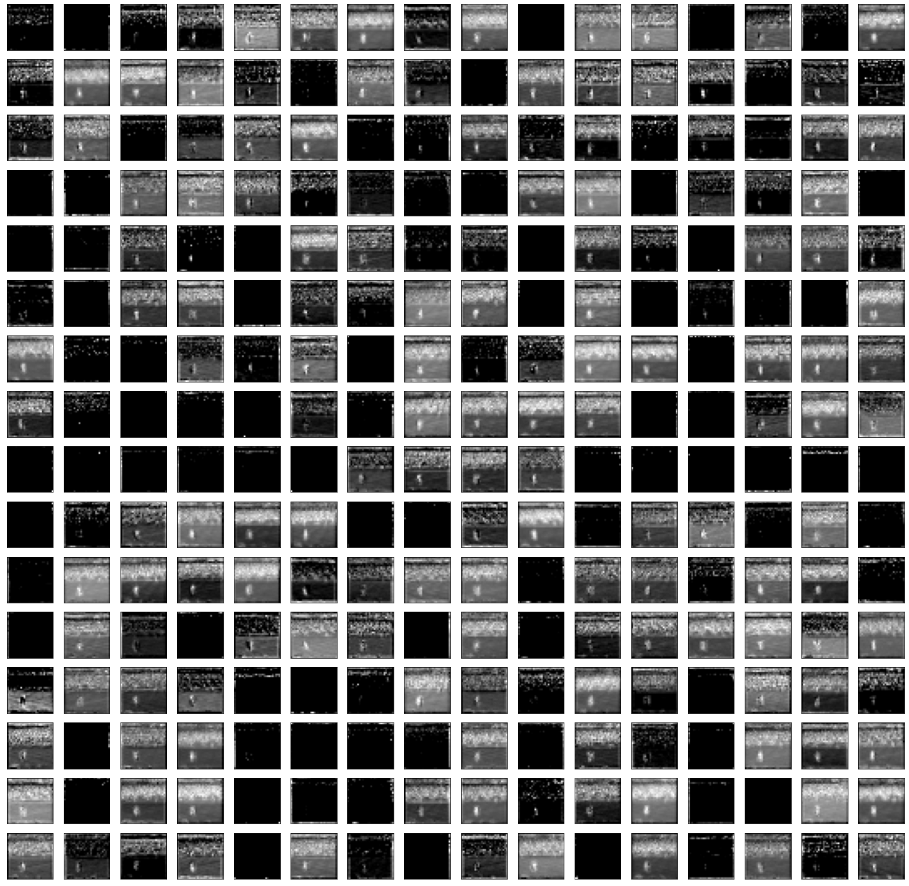
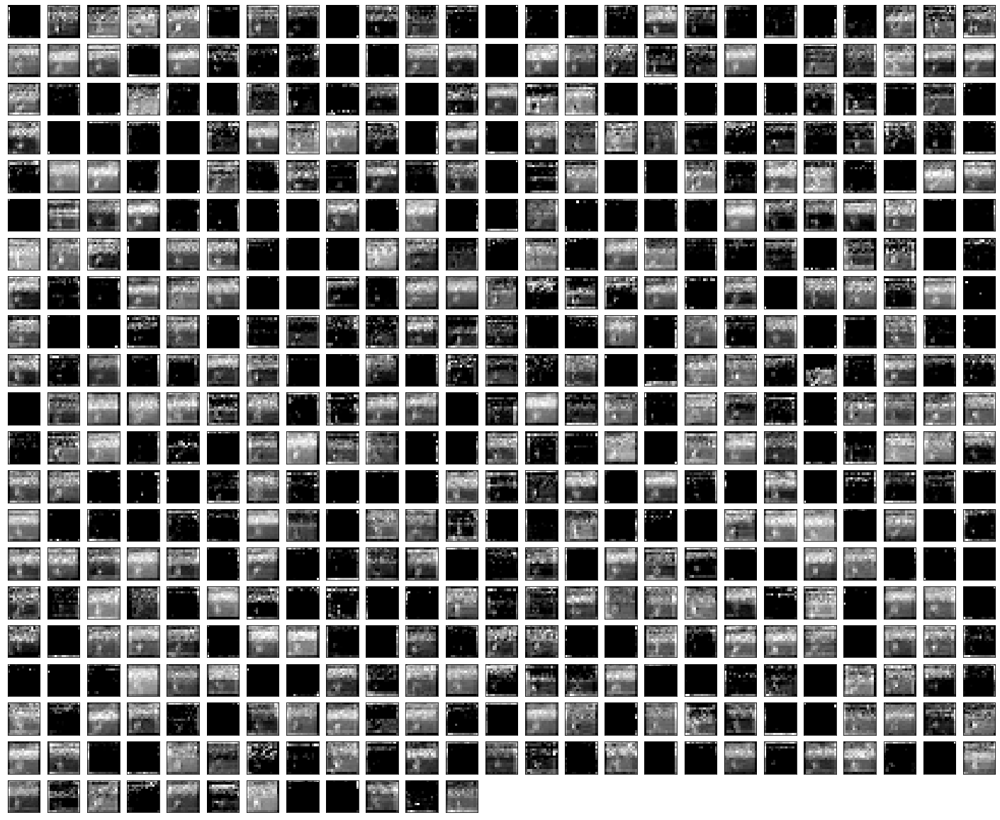
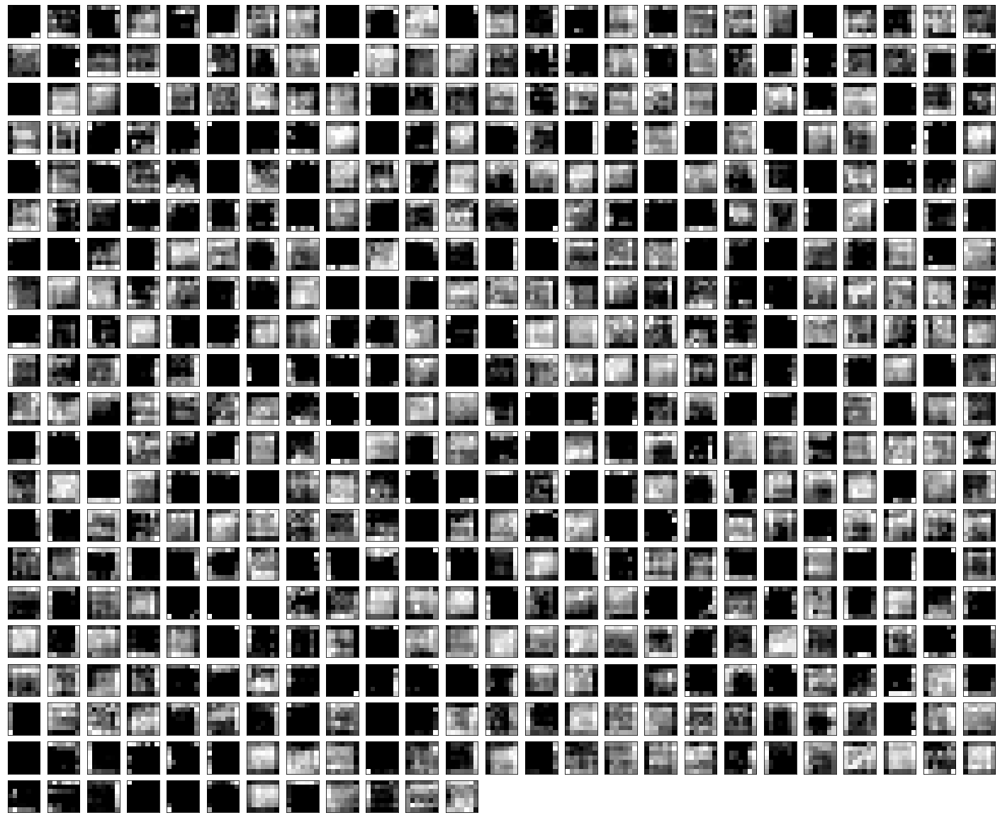

## VGG16-From-Scratch-
Code-VGG16-From-Scratch with Keras
Link google colab:
* [VGG16_From_Scratch_Tensorflow.ipynb](https://colab.research.google.com/drive/1SkvK323UFKRq4ZgiixmCbOZ7SFwTWS-v?usp=sharing)&nbsp;
## Installation
Clone This Repository.
```
git clone https://github.com/TieuDiem/VGG16-From-Scratch-.git
```
Install package necessary.
```
import tensorflow as tf
from tensorflow.keras.layers import Conv2D,Dense,MaxPooling2D
import cv2
import numpy as np
import matplotlib.pyplot as plt
```
## Inside VGG16 
* This's Architecture of VGG16 (CNN)
<div align="center">
<p>
</img>
</p>
</div>   

- Block 1
``` bash
Conv2D(filters =64,kernel_size =(3,3),padding="same",activation='relu',input_shape =(224,224,3)),
Conv2D(filters =64,kernel_size= (3,3),padding="same",activation='relu'),
MaxPooling2D(pool_size=(2,2),strides=(2,2)),
```
- Block 2    
``` bash
Conv2D(filters =128,kernel_size=(3,3),padding="same",activation="relu"),
Conv2D(filters =128,kernel_size=(3,3),padding="same",activation='relu'),
MaxPooling2D(pool_size =(2,2),strides =(2,2)),
``` 
- Block 3  
``` bash
Conv2D(filters =256,kernel_size=(3,3),padding="same",activation='relu'),
Conv2D(filters =256,kernel_size=(3,3),padding="same",activation='relu'),
Conv2D(filters =256,kernel_size=(3,3),padding="same",activation='relu'),
MaxPooling2D(pool_size =(2,2),strides =(2,2)),
```  
- Block 4    
``` bash
Conv2D(filters =512,kernel_size=(3,3),padding="same",activation='relu'),
Conv2D(filters =512,kernel_size=(3,3),padding="same",activation='relu'),
Conv2D(filters =512,kernel_size=(3,3),padding="same",activation='relu'),
MaxPooling2D(pool_size =(2,2),strides =(2,2)),
``` 
- Block 5    
``` bash
Conv2D(filters =512,kernel_size=(3,3),padding="same",activation='relu'),
Conv2D(filters =512,kernel_size=(3,3),padding="same",activation='relu'),
Conv2D(filters =512,kernel_size=(3,3),padding="same",activation='relu'),
MaxPooling2D(pool_size =(2,2),strides =(2,2)),
```  
## Result
<div align="center">
<p>
</img>
<p>Input Image</p>

</img>
<p>Feature Map After Block 1
  <br>TensorShape([1, 112, 112, 64])
</p>


</img>
<p>Feature Map After Block 2
  <br> TensorShape([1, 56, 56, 128])
</p>

</img>
<p>Feature Map After Block 
  <br>TensorShape([1, 28, 28, 256])
</p>

</img>
<p>Feature Map After Block 4
  <br>TensorShape([1, 14, 14, 512])
</p>

</img>
<p>Feature Map After Block 5
  <br>TensorShape([1, 7, 7, 512])
</p>
</p>
</div> 
