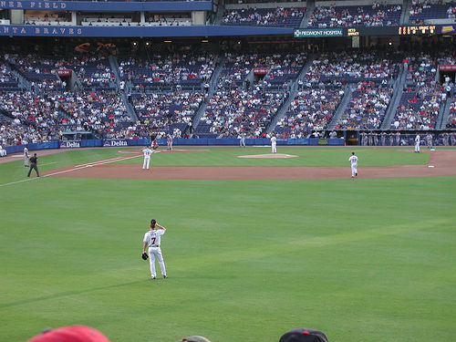

## VGG16-From-Scratch and Visualization How it Working ?
Code-VGG16-From-Scratch with Keras
Link google colab:
* [VGG16_From_Scratch_Tensorflow.ipynb](https://colab.research.google.com/drive/1SkvK323UFKRq4ZgiixmCbOZ7SFwTWS-v?usp=sharing)&nbsp;
* How to calculate output size,num of parameter after each Conv2D and MaxPooling2D, total parameter after model building.
```math
output{\_size}= \frac {input{\_size}{\space} - {\space}kernel{\_size}}{stride} {\space}+1
```
```bash
input_shape =(224,224)
kernel_size =(3 x 3)
stride =1
```
```math
output_size=\frac{224-3}{1}+1 = 221
```

* How to calculate after Conv2D.
```math
param = F * K * D.
```
* F: number of filters.
* K: kernel size.
* D: deep of input shape.
```
```
* How to calculate total param.
```math
$${Total\_param} = \sum_{i = 0}^{x{\space}={\space}total{\_param}} {\space}param_i$$
```
* Example
```bash
Conv2D(filters =64,kernel_size =(3,3),padding="same",activation='relu',input_shape =(224,224,3))
```
```math
num{\_param} = filters{\space}{*}{\space}{kernel\_size}{\space} * {\space}deep {\space}+{\space}filters = 64{\space}*{\space}3{\space}*{\space}*3{\space}*{\space}3{\space}+{\space}64={\space} 1972$
```
```bash
Conv2D(filters =64,kernel_size =(3,3),padding="same",activation='relu',input_shape =(224,224,3))
```
```math
param = 64 * 3 *3 * 64 + 64 = 36928 
```
```math
total{\_param} = 1972 +   36928  =  38.720
```


## Installation
Clone This Repository.
```
git clone https://github.com/TieuDiem/VGG16-From-Scratch-.git
```
Install package necessary.
```
import tensorflow as tf
from tensorflow.keras.layers import Conv2D,Dense,MaxPooling2D
import cv2
import numpy as np
import matplotlib.pyplot as plt
```
## Inside VGG16 
* This's Architecture of VGG16 (CNN)
<div align="center">
<p>
</img>
</p>
</div>   

- Block 1
``` bash
Conv2D(filters =64,kernel_size =(3,3),padding="same",activation='relu',input_shape =(224,224,3)),
Conv2D(filters =64,kernel_size= (3,3),padding="same",activation='relu'),
MaxPooling2D(pool_size=(2,2),strides=(2,2)),
```
- Block 2    
``` bash
Conv2D(filters =128,kernel_size=(3,3),padding="same",activation="relu"),
Conv2D(filters =128,kernel_size=(3,3),padding="same",activation='relu'),
MaxPooling2D(pool_size =(2,2),strides =(2,2)),
``` 
- Block 3  
``` bash
Conv2D(filters =256,kernel_size=(3,3),padding="same",activation='relu'),
Conv2D(filters =256,kernel_size=(3,3),padding="same",activation='relu'),
Conv2D(filters =256,kernel_size=(3,3),padding="same",activation='relu'),
MaxPooling2D(pool_size =(2,2),strides =(2,2)),
```  
- Block 4    
``` bash
Conv2D(filters =512,kernel_size=(3,3),padding="same",activation='relu'),
Conv2D(filters =512,kernel_size=(3,3),padding="same",activation='relu'),
Conv2D(filters =512,kernel_size=(3,3),padding="same",activation='relu'),
MaxPooling2D(pool_size =(2,2),strides =(2,2)),
``` 
- Block 5    
``` bash
Conv2D(filters =512,kernel_size=(3,3),padding="same",activation='relu'),
Conv2D(filters =512,kernel_size=(3,3),padding="same",activation='relu'),
Conv2D(filters =512,kernel_size=(3,3),padding="same",activation='relu'),
MaxPooling2D(pool_size =(2,2),strides =(2,2)),
```  
## Result
<div align="center">
<p>
</img>
<p>Input Image</p>

</img>
<p>Feature Map After Block 1
  <br>TensorShape([1, 112, 112, 64])
</p>


</img>
<p>Feature Map After Block 2
  <br> TensorShape([1, 56, 56, 128])
</p>

</img>
<p>Feature Map After Block 
  <br>TensorShape([1, 28, 28, 256])
</p>

</img>
<p>Feature Map After Block 4
  <br>TensorShape([1, 14, 14, 512])
</p>

</img>
<p>Feature Map After Block 5
  <br>TensorShape([1, 7, 7, 512])
</p>
</p>
</div> 
